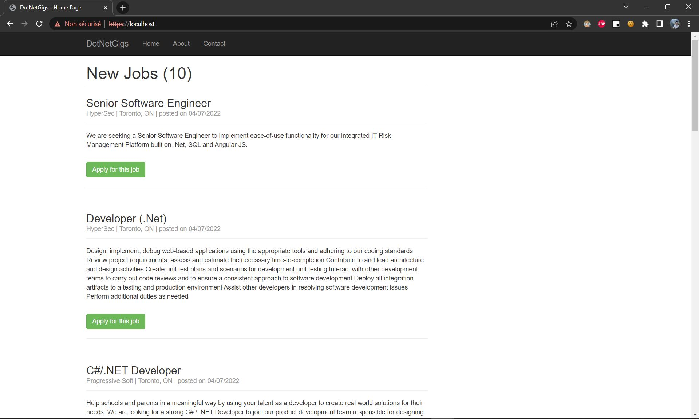
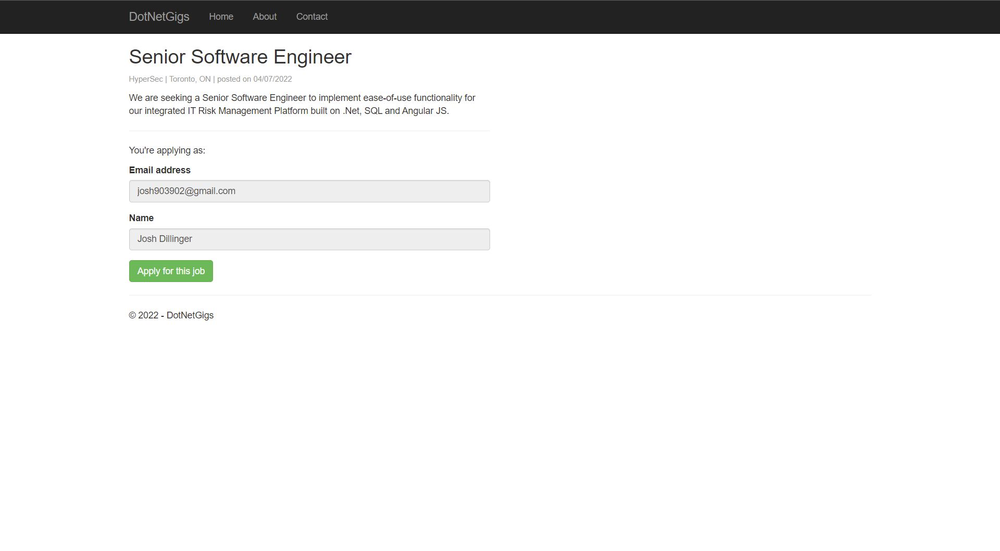
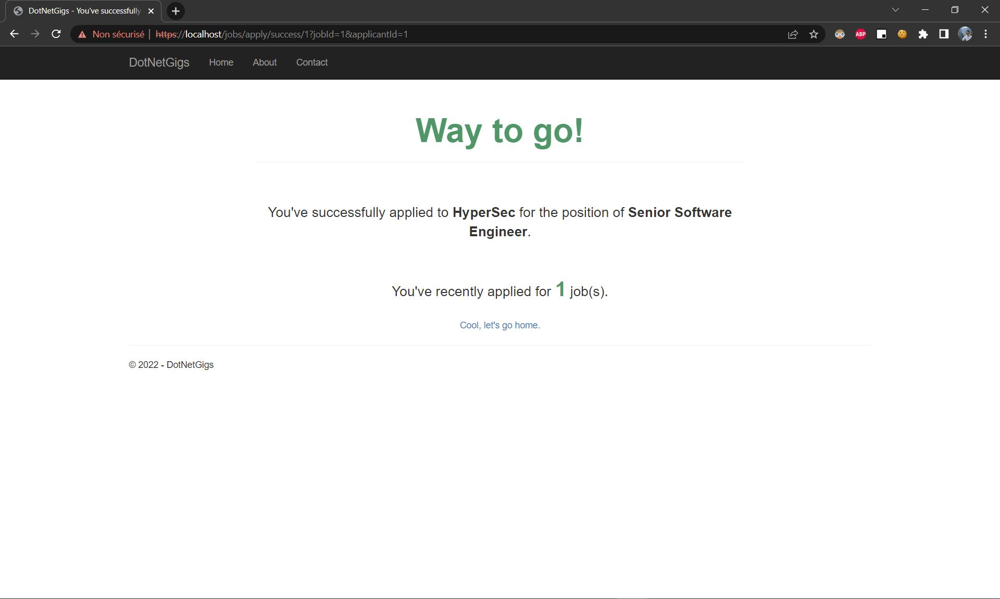
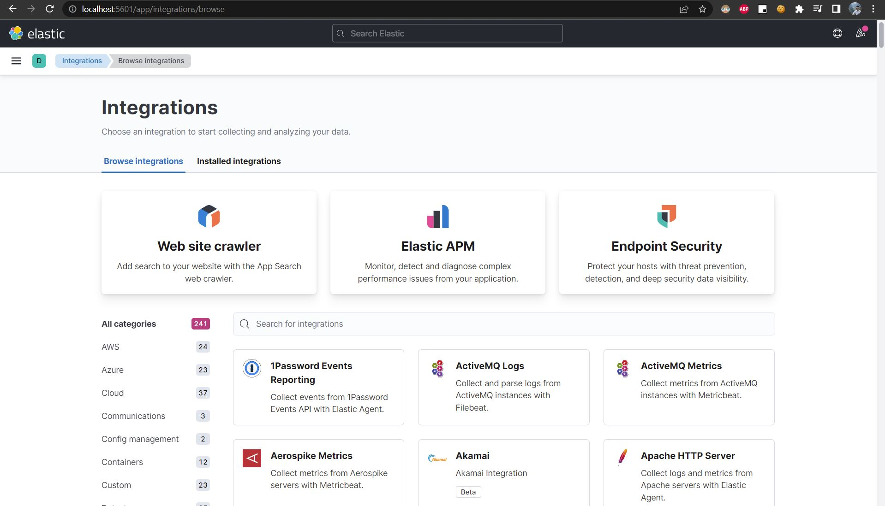

# Projet Conteneurisation et Orchestration - Ynov
#### Membres (Rodrigo Tapia - Fofana Djenabou - Emmanuel Noah)

## 1. Docker
#### a. Création des images
Lancez la commande suivante pour creer l'image du service lié au projet (applicants-api, identity-api, mssql, redis, rabbitmq)
```
docker build image-name:v1 fofanad97/image-name:v1 d -t image-name:v1 .
```

Lancez la commande suivante pour chaque image à fin de la tagger
```
docker tag image-name:v1 fofanad97/image-name:v1
```

#### b. Mise en ligne des images
Lancez la commande docker push pour renvoyer les images dans le repository
```
docker push image-name:v1 fofanad97/image-name:v1
```

## 2. Kubernetes
#### a. Création des manifests
- Déploiement
Un déploiement Kubernetes permet de gérer le cycle de vie d’une application, en définissant les images à utiliser, le nombre de replica (Replicaset) et bien d’autres paramètres.
- Service 
Un service est un objet permettant d’exposer une application composé de plusieurs pods. En effet, les pods possèdent leurs propres adresse IP. Un service est donc la couche d’abstraction qui permet d’accéder facilement aux pods de votre application.

#### b. Création des resources sur Kubernetes
Placez vous dans le répertoire des manifests, puis lancez les commandes correspondantes
```
kubectl create -f NAMEFILE
kubectl delete -f NAMEFILE
kubectl apply -f NAMEFILE
```

#### c. Ingress controller
Télechargerment du repo ingress nginx
```
kubectl create namespace NAMESPACE
helm repo add ingress-nginx https://kubernetes.github.io/ingress-nginx
```
Installation d'ingress controller
```
helm install nginx-ingress ingress-nginx/ingress-nginx --namespace NAMESPACE --create-namespace --set controller.replicaCount=2 --set controller.nodeSelector."kubernetes\.io/os"=linux
```

 



## 3. Bilan de santé
Installation des Prometheus
#### a. Vérification des Liveness et readiness probes 
```
kubectl describe pod <pod name> -n projet-cloud
```

#### b. Vérification des métriques serveur
```
kubectl top pods -n projet-cloud
```
```
kubectl top nodes -n projet-cloud
```

#### c. Configurer la redirection de port pour Prometheus
```
kubectl port-forward <pod name> 8080:9090 -n projet-cloud
```


## 4. Sécurité
#### a. Création des clés
Generer les clés grace à Openssl
```
openssl req -new -x509 -key private-key.pem -out cert.pem -days 360
```
#### b. Mettre les clés dans un secret.yml en base64 ou lancer 
Mettre les clés dans un secret.yml en base64 ou lancez la commande suivante
```
kubectl create secret tls test-tls --key="tls.key" --cert="tls.crt"
```
#### c. Modifier Ingress
Ajouter le secret au ingress
```
spec:
  tls:
  - hosts:
    - localhost
    secretName: tls-secret
  rules:
  - host: localhost
    http:
     ...
```

## 5. Mise en place d'un gestion de logs avancé
Afin de pouvoir les exploiter correctement les logs.
#### a. Télechargerment du repo elastic
```
helm repo add elastic https://helm.elastic.co/

```

#### c. Installation Elastic Search et Kibana
```
helm install elasticsearch --namespace=projet-elastic  elastic/elasticsearch -f override-elastic.yml
helm install kibana --namespace=projet-elastic  elastic/kibana
```


#### d. Configurez la redirection de port pour elasticSearch : 
```
kubectl port-forward svc/elasticsearch-master -n projet-elastic 9200
```

#### e. Configurez la redirection de port pour Kibana : 
```
kubectl port-forward deployment/kibana-kibana -n projet-elastic 5601
```




## 5. Déploiement automatisé
#### a. Installation du chart Helm
Lancez la commande suivante pour installer le projet
```
helm install projet ./projet-cloud -n projet-cloud
```

Lancez la commande suivante pour desinstaller
```
helm uninstall projet -n projet-cloud
```

#### b. Fichiers manifests
Le chart contient principalement les éléments suivants:

- un fichier *Chart.yaml* qui définit les metadata du projet,
- des ficchiers manifests *deploy.yaml* *service.yaml* *ingress.yaml*  utilisé pour la création des resources
- un fichier *values.yaml* utilisé pour substituer les variables par des valeurs dynamiques
- un fichier *NOTES.txt* qui donne des informations à la création de la release

```
$ cd projet-cloud
$ tree manifests
manifests
├── deploy.yaml
├── ingress.yaml
├── service.yaml
```


# [Gestion du Projet](https://github.com/users/rorrotapia/projects/3/views/2)

